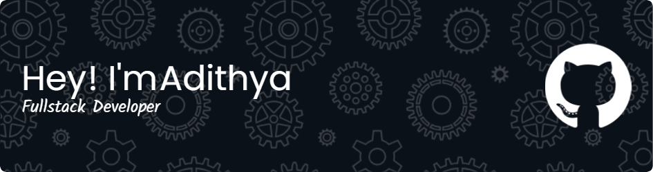

  <a href="https://aadhi-i.github.io/Portfolio/">Portfolio</a> -
  <a href="https://www.linkedin.com/in/adithya-s-nair-63153626b">LinkedIn</a> - 
  <a href="https://x.com/adithyasnair33?t=sg-79s_7Iojjn2wJQvkTig&s=09">Twitter</a> -
  <a href="https://aadhi-i.github.io/Portfolio/#contact">Contact me</a> 

  

### About

👨🏻‍💻 **About Me**
✨ Django Fullstack Developer | Open Source Contributor  
⚡ Checkout my ✨ [Portfolio](https://aadhi-i.github.io/Portfolio/)  
💬 Ask me about Web development | DSA   

## :zap: Open Source Programs & Achievements

  <table>
    <tr align="center">
      <td style="border-right: 1px solid #dddddd; padding: 15px;" valign="top" width="50%">
        <a href="">
          
           
          <strong>GirlScript Summer of Code 2024 Extended</strong>
        </a>
         
        🏅 Ranked 656th
         
        
	  Out of 28,000+ participants 
          PRs Merged: 8 
          Total Badges: 6 
          Total Score: 585 
        
      </td>
      <td style="padding: 15px;" valign="top" width="50%">
        <table>
          <tr align="center">
            <td style="border-right: 1px solid #dddddd; padding: 10px;" width="100">
              
               
              <strong>Explorer Badge</strong>
            </td>
            <td style="border-right: 1px solid #dddddd; padding: 10px;" width="100">
              
               
              <strong>Adventurer Badge</strong>
            </td>
            <td style="border-right: 1px solid #dddddd; padding: 10px;" width="100">
              
               
              <strong>Champion Badge</strong>
            </td>
          </tr>
          <tr align="center">
            <td style="border-right: 1px solid #dddddd; padding: 10px;" width="100">
              
               
              <strong>Summit Seeker Badge</strong>
            </td>
            <td style="padding: 10px;" width="100">
              
               
              <strong>API Student Expert</strong>
               
              Postman
            </td>
            <td style="padding: 10px;" width="100">
              
               
              <strong>Trailblazer Badge</strong>
            </td>
          </tr>
        </table>
      </td>
    </tr>
  </table>

 

### Holopin Badges

  

### Tools & Tech Stack I use

  
  
  
  
  
  
  
  
  
  
  
  
  
  
  
  
  
  
  
  
  
  
  
  
  
  
  
  
  
  

   

### My Stats

 

&nbsp;

